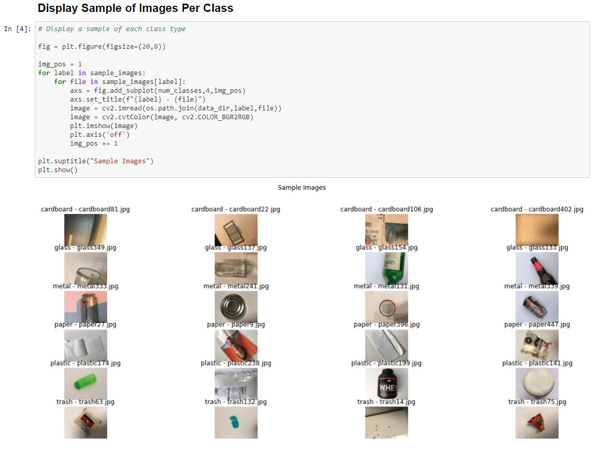

# Project - CanIRecycleIt.com

## Team Members

* CRO - Chief Recylcing Officer - Bruno Janota
* CTE - Chief Trash Executive - Daniel Olal
* CEO - Chief Environmental Officer - Daria Zhukova
* CSO - Chief Sustainability Officer - Kevin Hill
* CGO - Chief Green Officer - Javaria Hassan

## Background and Problem Definition(s)

Waste management is one of the most challenging problems to solve in the 21st century. The average American produces 1,704 pounds of garbage per year, roughly three times the global average, according to a [report](https://www.globalcitizen.org/en/content/americans-produce-most-waste/#:~:text=The%20average%20American%20produces%201%2C704,the%20research%20firm%20Verisk%20Maplecroft.) by the research firm Verisk Maplecroft in 2019. Poor waste management is linked to environmental risks, such as climate change and pollution, and consequent economic harm.

To achieve a sustainable future, it is imperative to develop an effective waste management system. Currently, a majority of waste is not recycled and ends up in sanitary landfills. Reasons for this include:

* Consumers placing non-recyclable items into recycling bins which leads to [inefficiencies](https://www.valleywasteservice.com/valley-waste-news/what-happens-if-you-put-non-recyclable-items-into-recycling-4034) in the sorting process.

* Consumers looking to buy recyclable products [may not know if a product is recyclable or not](https://news.slashdot.org/story/21/09/09/153219/california-aims-to-ban-recycling-symbols-on-things-that-arent-recyclable).

In light of these factors, we contribute a platform for consumers that detects and classifies recyclable materials using artificial intelligence and computer vision.

## Proposed Solution

We build and deploy a web-based application that will enable Users to take a picture of an item of trash and identify if it is recylcable or not.  Additionally we will provide the ability for Users to submit additional pictures to further improve model performance over time via incremental data acquisition.  Inference API will be exposed to enable additional integration of image classification functionality into other 3rd party applications if desired (mobile, etc.).

A CNN image classification model will be developed via a training pipeline to identify recylcable and non/recylcable materials.  An additional supporting multinomial classification model may be built to identify material types (e.g. plastic, metal, etc.) as additional feature input and user-explanatory information.

Expectation is that CNN models will take advantage of transfer learning and will be built on `resnet50` (or similar pre-existing architecture) with fine-tuning based on recyclable data-set.

We also envisioned a version of our model that would support image segmentation to identify trash objects on video streams and detect recyclable items in real time. In this experiment, we hope to fine tune Yolo v3.

## Draft Timeline

* Data pre-processing, labeling, EDA
* UI/UX ideation: Wireframing, etc.
* Modeling approach:
  * Initial baseline model results (UNET + SVM)
  * Tensorflow Object detection API/models
  * LeNet style CNN trained from scratch
  * Transfer Learning (ResNet50, MobileNet, InceptionResNetV2, DenseNet)
* Scalable, back-end Training pipeline development
* Model performance reporting dashboards
* Best model serialization and API development
* Web application deployment (Flask)

## Potential Datasets and Models considered

### Background Assessments

* [This github repo](https://github.com/AgaMiko/waste-datasets-review) contains information on different trash/waste related datasets.
* [This github repo](https://github.com/majsylw/litter-detection-review) contains a literature review of different approaches and performance results on above datasets.

### Waste Classification Data v2

Over 25k images divided into training data - 22564 + 2508 nonrecyclable images and test data - 2513 images + 397 from category nonrecyclable. Three main categories: Organic (O), recyclable (R), and nonrecyclable (N).

Available on Kaggle [here](https://www.kaggle.com/techsash/waste-classification-data).

### TrashNet for Specific Material Classification

The TrashNet Classification dataset contains 2467 images from 6 categories: cardboard (393), glass (491), metal (400), paper (584), plastic (472) and trash (127). I think it may be interesting to work with this dataset but it's size may be a challenge and I also think the categories are fairly obvious to an end user (i.e. most users would know if a piece of trash is plastic or metal but the above dataset classes of organic, nonrecyclable, and nonrecyclable may be more interesting for end users).

Download [here](https://github.com/garythung/trashnet/blob/master/data/dataset-resized.zip).

### Drinking Waste Classification

The dataset contains ~10k images groupped by 4 classes of drinking waste: Aluminium Cans, Glass bottles, PET (plastic) bottles and HDPE (plastic) milk bottles. Pictures were taken with 12 MP phone camera as a part of final year Individual Project at University College London. The dataset used parts of manually collected images from TrashNet.

### Portland State University Recycling Image Classification Dataset

Dataset composed of '11,500 image training data of 5 common recycling items' availble from [Portland State University](http://web.cecs.pdx.edu/~singh/rcyc-web/index.html).

Download from kaggle [here](https://www.kaggle.com/arkadiyhacks/drinking-waste-classification).

## Initial Results and EDA

We explored each of the three potential datasets above and found that each dataset may have potential shortcomings and we may need to sample images from each dataset to be included in a single larger dataset with classes for recyclable material and non-recyclable material.

### Trashnet

Initial performance from a transfer learning classification model on the Trashnet dataset resulted in a validation classification accuracy of about 80% across the 6 material classes in the dataset however, the limited size of this dataset and overall quality may not be sufficient to develop a front-end user application capable of detecting general recyclable materials vs. non-recyclable materials.

Here are a few sample images with respective labels from the trashnet dataset:

#### EDA Notebook

EDA and model prototyping for Trashnet can be found [here](../../notebooks/Trashnet_Exploration.ipynb).

### Waste Classification v2

The Waste Classification v2 dataset seems to be the most promising in terms of the number of training images but it also appears to have quite a few mislabeled images in each class upon initial inspection of incorrect predictions. It appears that this data was collected from searching google images but not much post-processing on the raw data collection was done. The initial performance of a Mobilenet classification model to predict between the recyclable, non-recylable, and organic classes resulted in a 86% validation accuracy. 

Here are a few sample images with respective labels from the waste classification v2 dataset:

Here is the loss and accuracy curve for the baseline Mobilenet architecture:

#### EDA Notebook

EDA and model prototyping for Waste Classification can be found [here](../../notebooks/Waste_Classification_EDA.ipynb).

### YOLO v5 for Identifying Recycalable Materials in a Live Stream

Given that we would like to provide a way to identify recycalable materials within a live video stream, we also tested real-time object detection using the Portland State Univerisy Recylcling Image Classification dataset which contained annotated images with bounding boxes for the trash object that we used to train Yolo v5. For adopting the model to distinguish between recycalable or not, we used the organic materials dataset out of Waste Classification v2 databank.

#### YOLO v5 Model Prototyping Notebook

Model prototyping for YOLO detection can be found [here](../../notebooks/Object_detection.ipynb).
